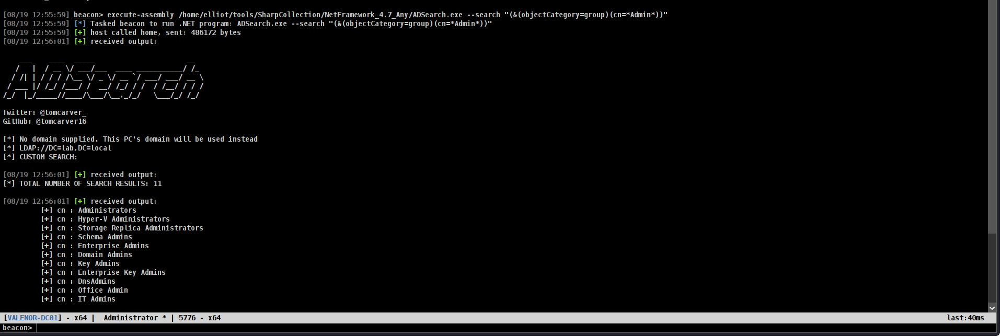
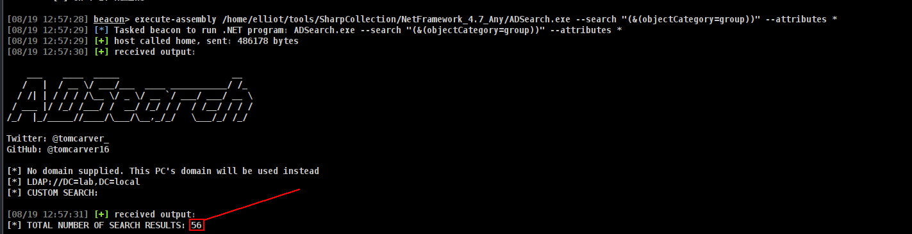
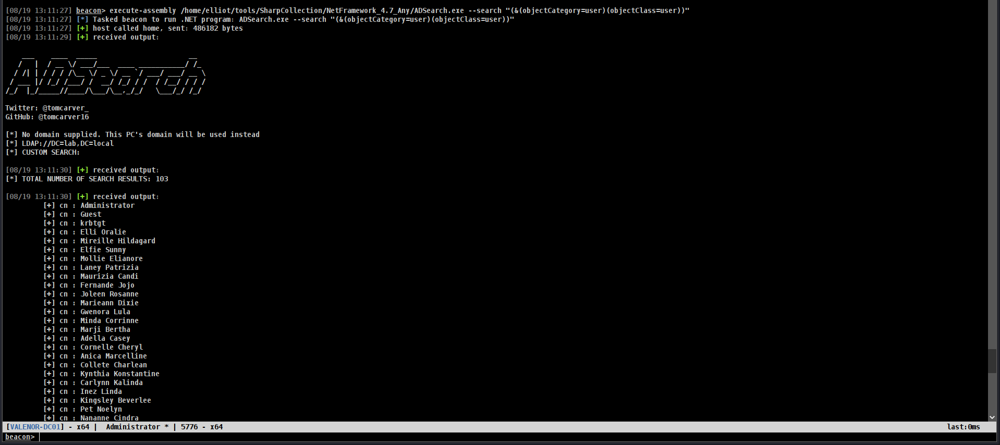
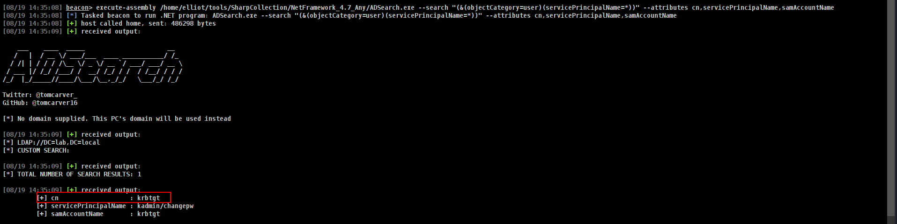
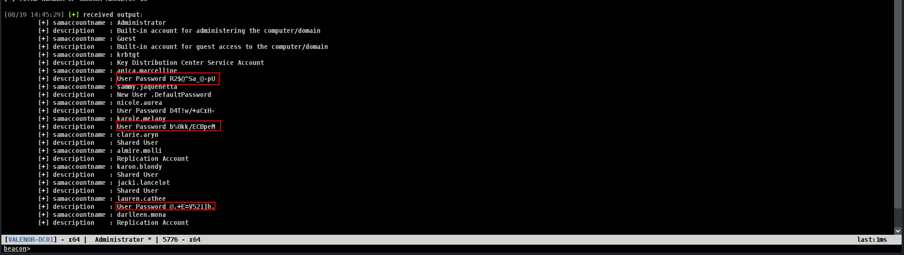
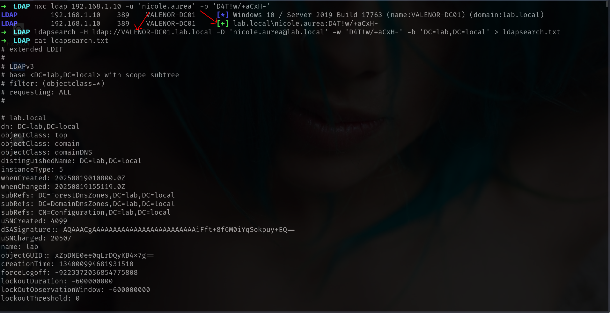



# 🖥️ The Heart of Domain Controller - LDAP

The **Domain Controller (DC)** is the backbone of **Active Directory**, and at its core lies **LDAP (Lightweight Directory Access Protocol)**. LDAP is the protocol that clients and services use to **query and modify directory objects**, such as users, groups, computers, and organizational units.

**LDAP** is indispensable because it enables the **enumeration of users, groups, and domain structure**. Misconfigured permissions or exposed LDAP services can inadvertently reveal sensitive information, sometimes even without requiring authentication.

Thus, **LDAP** is a critical component of **Active Directory**. If we want to dig deeper into Active Directory, it’s essential to leverage **LDAP**.

In this section, I will demonstrate how to use [ADSearch.exe](https://github.com/Flangvik/SharpCollection/blob/master/NetFramework_4.7_Any/ADSearch.exe) 

```
Check the Tools bar for the essential tools we will be using.
```

I will start by explaining the basic concepts of **LDAP**. Remote tools will be covered later.

# Basics of ADsearch

[ADSearch.exe](https://github.com/Flangvik/SharpCollection/blob/master/NetFramework_4.7_Any/ADSearch.exe) is a fantastic tool that can be used for basic **enumeration tasks**. It allows you to learn important details about the **domain**. However, keep in mind that tools like **BloodHound** are also available and offer much more powerful functionality.

## Enumerate Groups

Before enumerating the entire domain or **DC**, it's often beneficial to start by enumerating **Groups**. Groups are usually the most **important objects in LDAP**, and knowing which groups exist in the domain can be extremely useful.

- I use ***execute-assembly*** here to avoid putting **ADSearch** on disk, as antivirus/EDR might detect it. Always ensure you know where your files are located to expedite the process.

### 1.Enumerate Groups of all

```bash
execute-assembly /home/elliot/tools/SharpCollection/NetFramework_4.7_Any/ADSearch.exe --search "(&(objectCategory=group))"
```


This will return all the groups in the Domain Controller, which can be overwhelming. To filter the output, we can modify the search command.

### **2. Enumerate Groups with Specific Properties**

```bash
execute-assembly /home/elliot/tools/SharpCollection/NetFramework_4.7_Any/ADSearch.exe --search "(&(objectCategory=group))" --attributes cn,distinguishedName,member,description
```


Or we can check only by name of name

### **3. Search for Groups by Name Pattern**

```bash
execute-assembly /home/elliot/tools/SharpCollection/NetFramework_4.7_Any/ADSearch.exe --search "(&(objectCategory=group)(cn=*Admin*))"
```



This is useful for finding administrative groups. The `*Admin` pattern will match all groups with `*admin` in their names.

### **4. Get All Properties for Groups**

```bash
execute-assembly /home/elliot/tools/SharpCollection/NetFramework_4.7_Any/ADSearch.exe --search "(&(objectCategory=group))" --attributes *
```
This will display all available properties for the groups.



### **5. Enumerate Domain Admins Group Specifically**

If we want to check for the specific **"Domain Admins"** group, we can use the following query:

```bash
execute-assembly /home/elliot/tools/SharpCollection/NetFramework_4.7_Any/ADSearch.exe --search "(&(objectCategory=group)(cn=Domain Admins))"
```


***Summary of Key Points for Enumerating Groups*** :

- Use `-search` for LDAP filter queries.
- Use `-attributes` to specify which properties to return (comma-separated).
- UseUse wildcards in search filters to match patterns.
- Enclose LDAP filters in quotes for proper execution.

### Bonus : **Example to get all groups with their members:**

```bash
execute-assembly /home/elliot/tools/SharpCollection/NetFramework_4.7_Any/ADSearch.exe --search "(&(objectCategory=group))" --attributes cn,member --json
```


We added the `--json` flag because **ADSearch.exe** doesn't natively support pretty printing.

Here's a table **summarizing** some **important groups** and their associated **attack vectors** :

| Group | Description | Attack vectors / Risks |
|---|---|---|
| **Domain Admins** | The most powerful group in the domain. Members have full control over DCs and domain-joined machines. | Full domain compromise: dump NTDS.dit, modify objects, control infra. |
| **Enterprise Admins** | Exists in the forest root domain; rights over all domains in the forest. | Forest-wide compromise; modify trusts and forest settings. |
| **Schema Admins** | Can change the AD schema (object classes & attributes). | Schema backdoor persistence by modifying default security descriptors. |
| **Backup Operators** | Can bypass file permissions to run backups on DCs. | Can use VSS to exfiltrate NTDS.dit + SYSTEM for credential dumping. |

---
---

## Enumerate Users

### 1. Enumerate All users

```bash
execute-assembly /home/elliot/tools/SharpCollection/NetFramework_4.7_Any/ADSearch.exe --search "(&(objectCategory=user)(objectClass=user))"
```



This returns every user object in the domain. The result set can be very large, so you’ll usually want to tighten the filter to focus on high-value accounts.

### 2. Enumerate Kerberoastable users

```bash
execute-assembly /home/elliot/tools/SharpCollection/NetFramework_4.7_Any/ADSearch.exe --search "(&(objectCategory=user)(servicePrincipalName=*))" --attributes cn,servicePrincipalName,samAccountName
```
Accounts with `servicePrincipalName` entries are potential `Kerberoast` targets because they map to service tickets **(TGS)** that can be requested and then offline-cracked.



### 3. Enumerate Asreproastable users

```bash
execute-assembly /home/elliot/tools/SharpCollection/NetFramework_4.7_Any/ADSearch.exe --search "(&(objectCategory=user)(userAccountControl:1.2.840.113556.1.4.803:=4194304))" --attributes cn,distinguishedname,samaccountname
```
This finds users with the flag that allows `AS-REP` responses without **pre-authentication** — useful for AS-REP roasting.


### 4. **Password Never Expires Accounts**

```bash
execute-assembly /home/elliot/tools/SharpCollection/NetFramework_4.7_Any/ADSearch.exe --search "(&(objectCategory=user)(objectClass=user)(userAccountControl:1.2.840.113556.1.4.803:=65536))" --attributes samaccountname,displayname,pwdlastset
```
Accounts configured to **never expire** are attractive for long-term persistence and privilege escalation — track `pwdLastSet` to determine recency of use.


### 5. **Sensitive Accounts (AdminCount=1)**

```bash
execute-assembly /home/elliot/tools/SharpCollection/NetFramework_4.7_Any/ADSearch.exe --search "(&(objectCategory=user)(objectClass=user)(admincount=1))" --attributes samaccountname,displayname,memberof
```
`adminCount=1` is often set on accounts that are or were in **privileged groups**. These accounts deserve immediate attention during enumeration.


### 6. **Accounts with Descriptions (Often Contain Passwords) - ONE OF THE MOST IMPORTANT**

```bash
execute-assembly /home/elliot/tools/SharpCollection/NetFramework_4.7_Any/ADSearch.exe --search "(&(objectCategory=user)(objectClass=user)(description=*))" --attributes samaccountname,description
```
**Descriptions** regularly contain **human-entered notes** — sometimes **plaintext credentials**, service details, or useful contact information. This is a common and high-value find during pentests.



This is the one of the most important because its really common at **PENTESTS**

### 7. Constrained Delegation **- ONE OF THE MOST IMPORTANT**

```bash
execute-assembly /home/elliot/tools/SharpCollection/NetFramework_4.7_Any/ADSearch.exe --search "(&(objectCategory=user)(msds-allowedtodelegateto=*))" --attributes
```
Accounts allowed to **delegate** to specific services can be leveraged in **delegation-based** attacks. Inspect `msDS-AllowedToDelegateTo` closely for service names and targets.


Unconstrained Delegation

### 8. UnConstrained Delegation **- ONE OF THE MOST IMPORTANT**

```bash
execute-assembly /home/elliot/tools/SharpCollection/NetFramework_4.7_Any/ADSearch.exe --search "(&(objectCategory=user)(userAccountControl:1.2.840.113556.1.4.803:=524288))" --attributes samaccountname,dnshostname
```
`Unconstrained delegation` is highly **dangerous**: servers or accounts configured this way will **accept forwarded credentials** and can be abused to **impersonate users**. Flag and prioritize remediation.


Okey if we summarize

1. **Use `-json` flag** for better output formatting of array attributes like `memberOf`
2. **Combine filters** to find the most valuable targets
3. **Always check enabled status** with `(!(userAccountControl:1.2.840.113556.1.4.803:=2))`
4. **Sort by last logon/password last set** to find active accounts
5. **Look for service accounts** with `svc_`, `srv_`, `service` prefixes in samaccountname

---
---

## Enumerate Computers

**Computers** are equally important to enumerate because `misconfigurations` **(e.g., delegation or RBCD)** often live on machine objects.

### **1. Enumerate All Computer Accounts (Basic)**

```bash
execute-assembly /home/elliot/tools/SharpCollection/NetFramework_4.7_Any/ADSearch.exe --search "(&(objectCategory=computer)(objectClass=computer))"
```
This lists all **machine accounts**. The result can be filtered by **OU, name patterns, or attributes**.


Here, we have 4 computers.

### **2. Find Unconstrained Delegation Computers**

```bash
execute-assembly /home/elliot/tools/SharpCollection/NetFramework_4.7_Any/ADSearch.exe --search "(&(objectCategory=computer)(objectClass=computer)(userAccountControl:1.2.840.113556.1.4.803:=524288))" --attributes samaccountname,dnshostname
```


This will highlight machines configured for unconstrained delegation **(e.g., APP-01$)**, which are high-priority targets.

### **3. Find Constrained Delegation Computers**

```bash
execute-assembly /home/elliot/tools/SharpCollection/NetFramework_4.7_Any/ADSearch.exe -search "(&(objectCategory=computer)(objectClass=computer)(msDS-AllowedToDelegateTo=*))" --attributes samaccountname,dnshostname,msds-allowedtodelegateto --json
```

If **ADSearch** output is limited, you can fallback to **PowerShell** :

```powershell
powerpick  Get-ADComputer CLIENT-01 -Properties userAccountControl, msDS-AllowedToDelegateTo | Select-Object Name, userAccountControl, msDS-AllowedToDelegateTo
```


### **4. Find Resource-Based Constrained Delegation(RBCD) Computers - So important**

```bash
execute-assembly /home/elliot/tools/SharpCollection/NetFramework_4.7_Any/ADSearch.exe --search "(&(objectCategory=computer)(msDS-AllowedToActOnBehalfOfOtherIdentity=*))" --attributes dnshostname,samaccountname,msDS-AllowedToActOnBehalfOfOtherIdentity --json
```
**RBCD** allows one machine to act on behalf of another - a modern and powerful attack vector. Track `msDS-AllowedToActOnBehalfOfOtherIdentity` closely.


Okey its fairly enough tbh, I will summarize something

1. **Focus on high-value targets**: Domain Controllers, servers with unconstrained delegation,constrained delegation and RBCD
2. **Check enabled status**: Use `(!(userAccountControl:1.2.840.113556.1.4.803:=2))` to filter out disabled computers.
3. **Look for patterns**: Servers often have naming conventions like `SRV-`, `APP-`, `SQL-`, `WEB-`.
4. **Prioritize**: Domain Controllers → Servers with delegation → Workstations with LAPS  etc → Other workstations

---
---

## Bofs

There are **lightweight BOFs** for **Cobalt Strike** and other **C2 frameworks** that can perform **LDAP-like queries** from a **beacon**. Check projects like **[BOFHound](https://github.com/fortalice/bofhound)** for examples.

Example LDAP search for AS-REP roastable accounts (BOF / ldapsearch style):

```bash
ldapsearch (&(samAccountType=805306368)(userAccountControl:1.2.840.113556.1.4.803:=4194304))
```


BOFs are useful when you need in-memory, fileless enumeration from a C2 implant - I wanna keep it easy cause for other commands we can done with `--help`

# Remote Tools

## ldapsearch (no creds)

If you don’t have credentials, you can still run anonymous queries (when allowed):

```bash
ldapsearch -x -H ldap://192.168.1.10 -b "dc=lab,dc=local" > ldapsearch.txt
```


The -b parameter sets the base **DN (derived from the domain name)**. **Anonymous** binds often return **limited information**.

## ldapsearch (with creds)

When you have **credentials**, queries return much **richer data**:

```bash
ldapsearch -H ldap://VALENOR-DC01.lab.local -D 'nicole.aurea@lab.local' -w 'D4T!w/+aCxH-' -b 'DC=lab,DC=local' > ldapsearch.txt
```



Large outputs can be **unwieldy** (example counts):

```bash
➜  LDAP cat ldapsearch.txt | wc -l
9032
➜  LDAP cat ldapsearch.txt | wc -c
284673
```
## Quick parsing with bash

```bash
# Find entries that mention "Password"
cat ldapsearch.txt | grep -i "Password"  

# Find descriptions (often user-supplied notes)
cat ldapsearch.txt | grep -i "description"

# Extract a username list from sAMAccountName attributes
cat ldapsearch.txt | grep -i "sAMAccountName" | awk '{print $2}'
```


These **quick filters** help you identify juicy artifacts like **plaintext notes, password hints, and lists of account names**.

[Lineeralgebra](https://www.youtube.com/@osmandagdelen9575) - [Ethicxz](https://x.com/ethicxz)

If there is anything wrong on a post, add me on discord : "ethicxz." or dm me on twitter