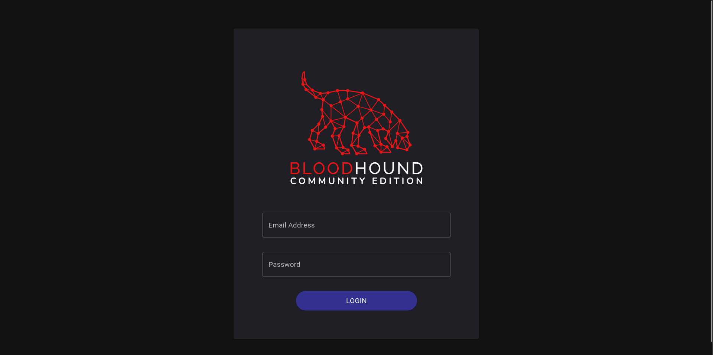
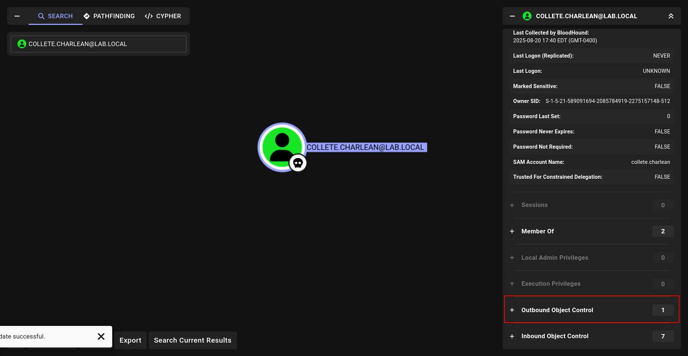
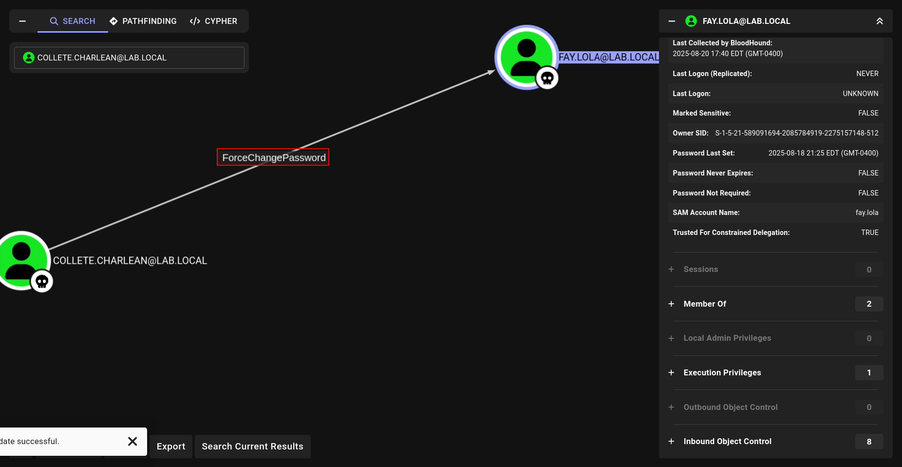
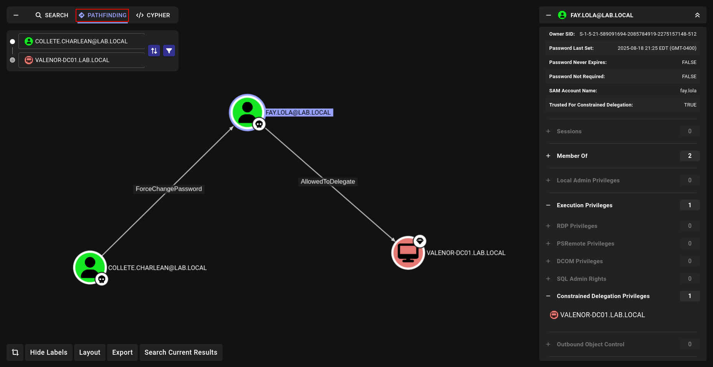
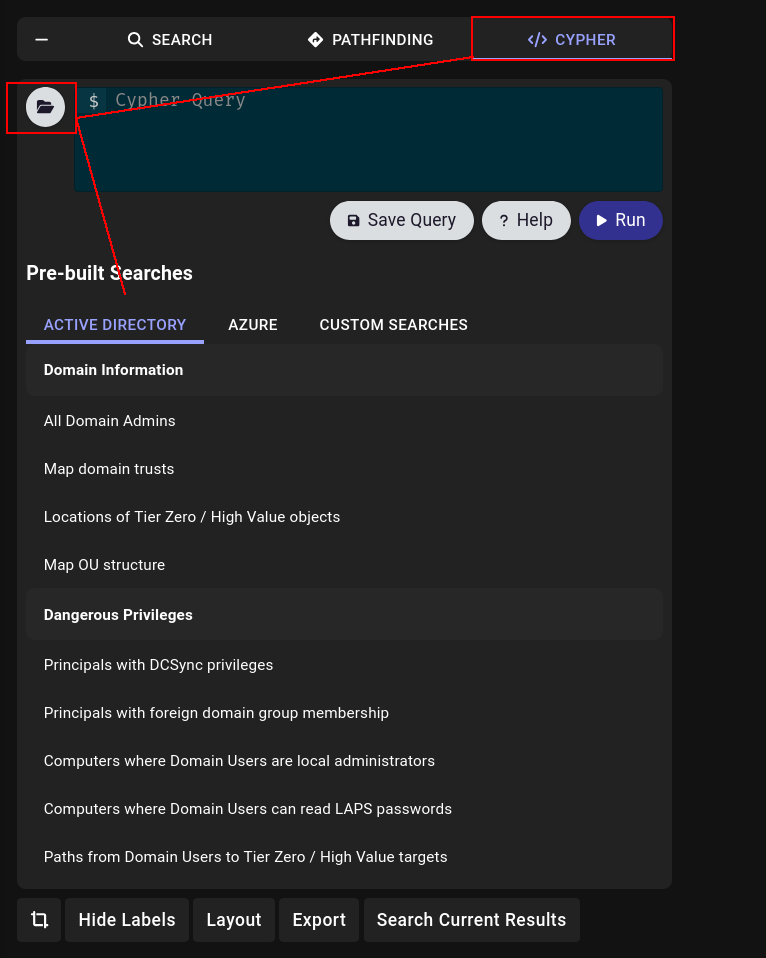



# 🐕‍🦺 BloodHound – Mapping Active Directory Made Easy

Bloodhound makes our jobs significantly easier, **but that doesn't mean it can see everything.**

Sometimes, **manual verification** is necessary. **Bloodhound** itself never interacts with the target environment; it only **analyzes the data you provide**. Therefore, manual checks are still an **essential** part of a thorough assessment.

The first thing I do after obtaining credentials or a shell within a forest is to **dump BloodHound** data. This step makes understanding the **attack paths** incredibly easy.

## Bloodhound? Which One?

There are two main versions I know of → **Bloodhound Community Edition (CE)** and **Bloodhound with neo4j (the legacy)**

To be honest, the legacy neo4j version is very powerful, but the CE version has a more modern and user-friendly interface, so I will be using it for this guide. 😀

You can find [the latest installation instructions here](https://threatexpress.com/blogs/2025/install-bloodhound/) (note that the process can change):

The installation is straightforward. Here is the setup I always use:

```bash
➜  BHCE ls -al
total 12
drwxrwxr-x  2 elliot elliot 4096 Jul  9 02:02 .
drwxrwxr-x 47 elliot elliot 4096 Aug 19 16:24 ..
-rw-rw-r--  1 elliot elliot 3907 Jul  9 02:02 docker-compose.yml
```
This is a basic `docker-compose.yml` file used to deploy the container.

- It will provide you with default **credentials** upon first startup. You should change the **default password** immediately. After that, you can use the **password you set for all logins**.

```bash
sudo docker-compose up
```
This is how I deploy and start the **Bloodhound CE instance**.


Navigate to the login page at: [`http://localhost:8080/ui/login`](http://localhost:8080/ui/login)



You can now log in using the **credentials** `admin` and the **password you configured**.


This is the **main dashboard**. It indicates that we need to **upload data**. Let's explore how to collect that data.

## Dump Bloodhound Data

There are **numerous methods** for dumping **Bloodhound data**, and I will try to cover all the ones I am familiar with.

**BUT FIRST, THERE ARE SOME CRITICAL PREREQUISITES TO UNDERSTAND:**

- You can typically **DUMP Bloodhound** data only from a **Domain Controller** (DC) of the domain.
- You can **DUMP Bloodhound** data only if you have **LDAP access**. (Even if you have SMB access, without LDAP, you cannot perform the dump. LDAP access is essential).

First, let's verify that we have **LDAP** access.

```bash
➜  bloodhound nxc ldap 192.168.1.10 -u ldapuser -p 'Password123!'
LDAP        192.168.1.10    389    VALENOR-DC01     [*] Windows 10 / Server 2019 Build 17763 (name:VALENOR-DC01) (domain:lab.local)
LDAP        192.168.1.10    389    VALENOR-DC01     [+] lab.local\ldapuser:Password123! 
```

If this **command fails**, it means we ***cannot*** dump **Bloodhound data**.

### Dump Bloodhound Data with netexec

Nowadays, [NetExec](https://github.com/Pennyw0rth/NetExec) is on fire 🔥. It supports almost everything we need, including dumping Bloodhound data.

```bash
nxc ldap <DC_FQDN> or <DC_IP> -u ldapuser -p '<password>' --bloodhound --dns-server <DC_IP> --collection All
```
This is the command I always use. I prefer using the **DC's FQDN** instead of its **IP** address because sometimes **NetExec** cannot resolve the **DC's IP**, which can cause the command to fail.
    

    

The `--collection all` **flag** instructs the tool to collect **all data types (users, groups, computers, etc.).**

And there you have it! We've successfully collected our first set of **BH data**. Of course, there are **other methods available**.

### Dump Bloodhound Data with bloodhound.py

[Bloodhound.py](https://github.com/dirkjanm/BloodHound.py) is another excellent tool for this purpose. I prefer using it in large domains, as I will demonstrate next.

Basic Usage:

```bash
bloodhound-python -ns <DC_IP> --dns-tcp -u ldapuser -p '<password>' --zip -c All -d <domain>
```


### Dump Bloodhound Data with bloodhound.py and dnschef

In large forests, you might not be able to use bloodhound.py directly. You may need to disable connection pooling or use a tool like [dnschef](https://github.com/iphelix/dnschef) to handle DNS resolution properly. Using both tools together is often the best approach.

https://github.com/iphelix/dnschef

Here is the typical usage

```bash
# first shell
dnschef --fakeip <dc_ip> --fakedomains <domain_name> -q

# second shell
bloodhound-python -u 'ldapuser' -d <domain_name> -p '<password>' -ns 127.0.0.1 --disable-pooling --zip -c all,loggedon --dns-timeout 50 -dc <DC_FQDN>
```


### Dump Bloodhound Data with SharpHound.exe

https://github.com/SpecterOps/SharpHound

This is the original and most robust tool for collecting **BH data** 😄. I always get the latest binaries from https://github.com/Flangvik/SharpCollection

I prefer to use `execute-assembly` to run it without touching the **disk**, but you can also run it directly (.\SharpHound.exe) if you wish.

```bash
execute-assembly /home/elliot/tools/SharpCollection/NetFramework_4.7_Any/SharpHound.exe -c All
```


### Dump Bloodhound Data with SharpHound.exe with creds

The previous command is standard, but it relies on the **permissions** of the user you have a **beacon/shell** with. If that user doesn't have the necessary **permissions**, you can provide **explicit credentials**

```bash
execute-assembly /home/elliot/tools/SharpCollection/NetFramework_4.7_Any/SharpHound.exe --ldapusername "ldapuser" --ldappassword "Password123!" -c All
```


It functions the same way but uses the provided credentials.

### Dump Bloodhound Data with SharpHound.ps1

[SharpHound.ps1](https://raw.githubusercontent.com/BloodHoundAD/BloodHound/master/Collectors/SharpHound.ps1) is another great tool for **data collection.**

```powershell
PS C:\Users\Administrator\Documents> . .\SharpHound.ps1

PS C:\Users\Administrator\Documents> Invoke-BloodHound -c All
2025-08-20T13:19:20.3690471-07:00|INFORMATION|This version of SharpHound is compatible with the 5.0.0 Release of BloodHound
2025-08-20T13:19:20.5876322-07:00|INFORMATION|Resolved Collection Methods: Group, LocalAdmin, GPOLocalGroup, Session, LoggedOn, Trusts, ACL, Container, RDP, ObjectProps, DCOM, SPNTargets, PSRemote, UserRights, CARegistry, DCRegistry, CertServices
2025-08-20T13:19:20.6190284-07:00|INFORMATION|Initializing SharpHound at 1:19 PM on 8/20/2025
2025-08-20T13:19:20.6501143-07:00|INFORMATION|Resolved current domain to lab.local
2025-08-20T13:19:20.7752752-07:00|INFORMATION|Flags: Group, LocalAdmin, GPOLocalGroup, Session, LoggedOn, Trusts, ACL, Container, RDP, ObjectProps, DCOM, SPNTargets, PSRemote, UserRights, CARegistry, DCRegistry, CertServices
2025-08-20T13:19:20.8688512-07:00|INFORMATION|Beginning LDAP search for lab.local
2025-08-20T13:19:20.9628548-07:00|INFORMATION|Beginning LDAP search for lab.local Configuration NC
2025-08-20T13:19:20.9941133-07:00|INFORMATION|Producer has finished, closing LDAP channel
2025-08-20T13:19:20.9941133-07:00|INFORMATION|LDAP channel closed, waiting for consumers
2025-08-20T13:19:21.4936050-07:00|INFORMATION|Consumers finished, closing output channel
2025-08-20T13:19:21.5251285-07:00|INFORMATION|Output channel closed, waiting for output task to complete
Closing writers
2025-08-20T13:19:21.6811902-07:00|INFORMATION|Status: 413 objects finished (+413 Infinity)/s -- Using 147 MB RAM
2025-08-20T13:19:21.6811902-07:00|INFORMATION|Enumeration finished in 00:00:00.8420376
2025-08-20T13:19:21.7594435-07:00|INFORMATION|Saving cache with stats: 27 ID to type mappings.
 2 name to SID mappings.
 1 machine sid mappings.
 4 sid to domain mappings.
 0 global catalog mappings.
2025-08-20T13:19:21.7905337-07:00|INFORMATION|SharpHound Enumeration Completed at 1:19 PM on 8/20/2025! Happy Graphing!
```

The usage is very similar to **the EXE version**. I just wanted to demonstrate it and make a note of it here.

### Bonus : Rusthound

I have barely used [rusthound](https://github.com/NH-RED-TEAM/RustHound) but it's another viable option for data collection.

```bash
➜  RustHound git:(main) ✗ rusthound -d <domain> -u 'ldapuser' -p '<password>' -o /tmp/demo -z
```

## Upload Bloodhound Data and Analyze

You can upload your collected files at [`http://localhost:8080/ui/administration/file-ingest`](http://localhost:8080/ui/administration/file-ingest)


You can upload the `.zip` file directly.


Once the upload is complete, the status will change to `Complete`.

Now, let's start **analyzing**!

## Users

### Analyze Users and give them Node

For example, we dumped the **BH data** using the `ldapuser` **account**. We can now search for this user and mark them as "**Owned**".


The **node's** appearance will change to indicate it is **owned**.


For other users, we can check the **next steps** in the **attack path**. For instance, we can see what a specific user can do.


We can then see **what permissions or actions that user has**.


If we click on `Constrained Delegation` it will show us **which systems we can impersonate users against**.


If you `LEFT-CLICK` on a **node**, you will see **detailed information** and potential abuse commands.


**Bloodhound** provides both `Linux` and `Windows` abuse commands. We will look at those in more detail later in the attack sections. For now, we are focusing on exploration.

### The power of Outbound Object Control



We discovered that our user has **Outbound Object Control over another object**.



We can see that our user has the permission to change `fay.lola`'s password. If we can successfully abuse this, what could we achieve? In other words, what could we do if we compromised `fay.lola`?

### Pathfinding For The Win

In the first step, we found we can **OWN** `fay.lola`. Let's check what `fay.lola` can do.


We discovered that `fay.lola` has a path to the **Domain Controller**. Instead of checking each step manually, we can use the **Pathfinding feature**.



Now we have a complete and **clear view of our entire attack path**.

## Groups

Groups are critically important in Active Directory security. Here is a reference table for some key groups:

| Group | Description | Attack Vectors / Risks |
| :--- | :--- | :--- |
| **Domain Admins** | The most powerful group in the domain. Members have administrative control over all domain controllers and, by inheritance, all domain-joined computers. | Full compromise of the domain. Can dump credential databases (NTDS.dit), modify any object, and control all infrastructure. |
| **Enterprise Admins** | Exists only in the forest root domain. Members have administrative rights over all domains within the entire Active Directory forest. | Forest-wide compromise. Can modify forest-level settings and trust relationships. |
| **Schema Admins** | Members can modify the Active Directory schema, which defines all object classes and attributes. | Can perform a "schema backdoor" by modifying the default security descriptors of object classes to add a backdoor account, granting them persistence on every new object created. |
| **Administrators** | A local group on domain controllers. By default, contains the Domain Admins, Enterprise Admins, and Administrator accounts. | Effectively equivalent to Domain Admin on domain controllers. Provides local admin rights on all DCs. |
| **Server Operators** | Members can administer domain controllers. They can log on locally, create/delete network shares, start/stop services, and backup/restore files. | Can replace service binaries with malicious ones, access sensitive files on DCs via shares, and use built-in backup utilities to access otherwise locked files (e.g., NTDS.dit). |
| **Backup Operators** | Members are allowed to log onto DCs locally and bypass file permissions to perform backup operations. | **Considered Tier 0 (equivalent to Domain Admin).** Can use the Volume Shadow Copy Service (VSS) to make a shadow copy of the `C:` drive and exfiltrate the NTDS.dit database and SYSTEM registry hive for credential dumping. |
| **Account Operators** | Members can create and modify most types of accounts (users, groups) but cannot modify administrative groups or log on to DCs by default. | Can create new accounts and add them to less privileged groups they control, or modify existing user attributes (e.g., `scriptPath`) for logon script execution. |
| **Print Operators** | Members are allowed to logon to domain controllers locally and install printer drivers. | The driver installation process can be abused to load a malicious DLL instead of a printer driver, leading to code execution on the DC as `SYSTEM`. |
| **DNS Admins** | Members have administrative rights to manage the DNS server service and zones. | Can configure the DNS server to load a malicious DLL, leading to code execution as `SYSTEM` the next time the service is restarted (often causing a crash if done live). |
| **Group Policy Creator Owners** | Members are granted permission to create new Group Policy Objects (GPOs) in the domain. | **Requires additional permissions to be dangerous.** If also granted rights to *link* GPOs to OUs (e.g., via Delegate Control), they can deploy a malicious GPO to computers or users, leading to command execution. |
| **Remote Desktop Users** | Members are granted the "Allow log on through Remote Desktop Services" right. Not privileged by itself. | A common misconfiguration is to grant this right to a user or group on high-value servers or even Domain Controllers, enabling direct RDP access for lateral movement. |
| **Remote Management Users** | Members are granted the right to access Windows Remote Management (WinRM), enabling PowerShell Remoting (PSRemoting). | Provides a method for lateral movement via PowerShell. If granted on a DC or administrative server, it can be a direct path to privilege escalation. |
| **Hyper-V Administrators** | Members have full control over Hyper-V management and virtual machines on hosts where the role is installed. | Can potentially escape to the host OS, compromising the physical server. |

For example, before we start, it's important to check groups like `Remote Management Users` and `Remote Desktop Users` because they can grant direct access via **WinRM** or **RDP**.


From this, we can understand that our **user** has **WinRM** access to these **specific computers**.

```bash
➜  bloodhound nxc winrm 192.168.1.10 -u ldapuser -p 'Password123!'
WINRM       192.168.1.10    5985   VALENOR-DC01     [*] Windows 10 / Server 2019 Build 17763 (name:VALENOR-DC01) (domain:lab.local)
WINRM       192.168.1.10    5985   VALENOR-DC01     [+] lab.local\ldapuser:Password123! (Pwn3d!)
```
<div style="
  background-color: #0d1117;
  border: 1px solid #1f6feb;
  border-radius: 6px;
  padding: 16px;
  color: #c9d1d9;
  margin: 1.5em 0;
  font-family: system-ui, sans-serif;
">
  <p style="margin: 0 0 1em; font-weight: 600; color: #58a6ff;">
    <span style="margin-right: 6px;">ℹ️</span>Note
  </p>
  <p style="margin: 0 0 1em;"> ⚠️​ NOTE ⚠️​ </p>

  <pre style="
    background-color: #161b22;
    padding: 12px;
    border-radius: 6px;
    overflow-x: auto;
    margin: 0;
  "><code style="color: #c9d1d9;">If you are in a LARGE forest and don't see any members in "Remote Management Users" in Bloodhound, it doesn't necessarily mean you can't use Evil-WinRM. The user might be a member of a local group on a member server, not a domain group.</code></pre>
</div>

You can check it with

```bash
# FILE01 = 192.168.1.14 in this example
➜  bloodhound nxc winrm 192.168.1.14 -u smbuser -p 'Password123!' --local-auth
```
### How does this work?

`ldapuser` → member of `Remote Management Users` **(Domain Group)** → can use **WinRM on the DC**.

`smbuser` → not a member of `Remote Management Users` **(Domain Group)** → but might be a member of the local `Remote Management Users` group on `FILE01` server. **Bloodhound** typically ***only collects domain group memberships from the DC***.


Here, you can find users with **HUGE privileges**, like the **Administrator** user who is a member of **Domain Admins**.

## The Power of Cypher Queries

`Bloodhound CE` includes a fantastic feature for running custom **Cypher queries**, allowing you to find interesting information that might not be visible through standard UI searches.



### Find All Kerberoastable Users


We can use a **query to list all users** with `SPNs (Service Principal Names)`, which are vulnerable to `Kerberoasting attacks`. We will cover this attack in the `Kerberoast section`.

### Find AS-REP Roastable Users


This query finds users who do not require **pre-authentication**, making them vulnerable to `AS-REP Roasting`.

### Find the Shortest Path to Domain Admins


As you may remember, we previously marked `COLETTE.CHARLEAN` as **"Owned"** Now we can use a **pathfinding query** to see the **complete path from her to the Domain Admins group**.

This is the true power of  🔥

**These are just the basics; we will explore every attack in detail in the dedicated Attack Sections.**

## Bonus: Finding Passwords in Descriptions

**Bloodhound** can also reveal user passwords **if** they have been **mistakenly** stored in the Active Directory `Description` field.


If you are interested in learning more about **Bloodhound Cypher queries**, I highly recommend this **cheatsheet**:

[Cypher CheatSheet](https://hausec.com/2019/09/09/bloodhound-cypher-cheatsheet/)

[Lineeralgebra](https://www.youtube.com/@osmandagdelen9575) - [Ethicxz](https://x.com/ethicxz)

If there is anything wrong on a post, add me on discord : "ethicxz." or dm me on twitter